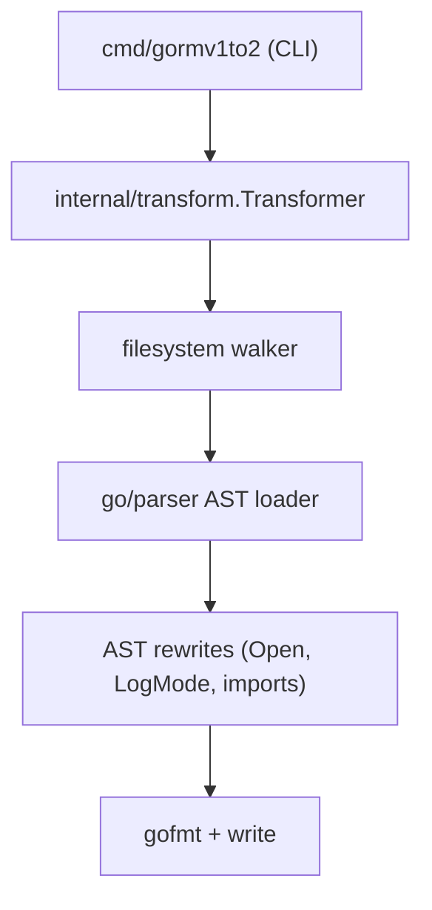
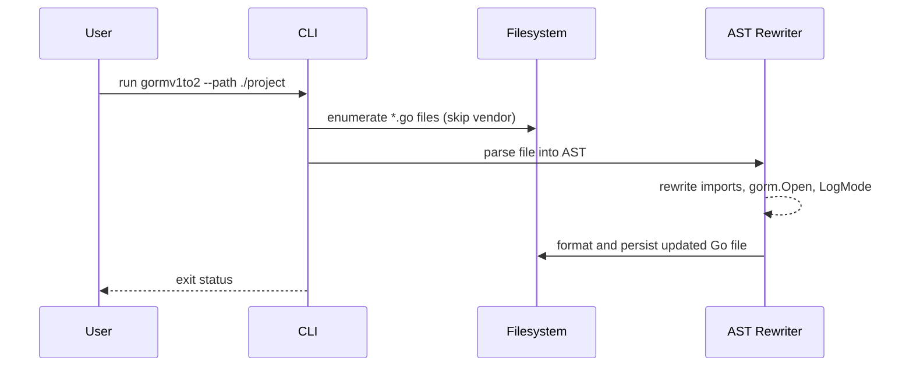
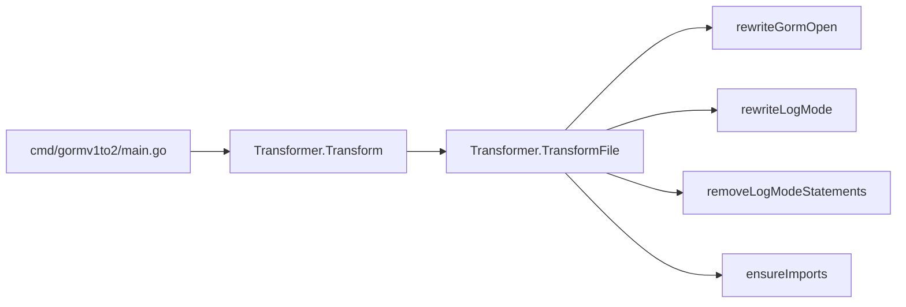

# gorm-v1to-v2

A tool that automatically migrates legacy GORM v1 code (`github.com/jinzhu/gorm`) to modern GORM v2 (`gorm.io/gorm`).

一款自动化迁移工具，用于将项目中的 GORM v1 使用方式平滑迁移到 GORM v2，同时保持业务逻辑与行为不变。

## Quick start

```bash
# Run the migrator against your codebase (defaults to current directory)
go run ./cmd/gormv1to2 --path /path/to/your/project
```

## 业务功能记录（迁移前后保持一致）

| 功能/行为 | 迁移前 | 迁移后 |
| --- | --- | --- |
| GORM 版本依赖 | 使用 `github.com/jinzhu/gorm` | 使用 `gorm.io/gorm` 并自动补充对应驱动 | 
| 数据库连接写法 | `gorm.Open("mysql", dsn)` 等方言字符串 | `gorm.Open(mysql.Open(dsn), &gorm.Config{})` 等 v2 写法 |
| 日志配置 | 可调用 `db.LogMode(true)` | 自动移除 `LogMode`，使用 v2 默认 logger（业务逻辑不变） |
| 业务代码 | 保持原有业务逻辑与数据流 | 保持不变，仅更新 ORM API |

> 该表用于记录迁移前后的功能状态，确保每次修改都不会改变业务功能。

## System architecture



## Data flow



## Call graph (core path)



## User-visible use cases

- As a maintainer, I can point the CLI at a repository to rewrite GORM v1 usage to GORM v2 idioms without changing business logic.
- 作为开发者，可以在 `gorm.Open` 使用 MySQL、Postgres、SQLite 或 SQL Server 方言时自动插入对应驱动 import。
- 作为工程师，可以自动移除 `LogMode` 调用并使用 GORM v2 默认日志行为。

## Migration rules implemented

- Replace `github.com/jinzhu/gorm` imports with `gorm.io/gorm` and add the correct driver import inferred from `gorm.Open` dialect strings.
- Convert `gorm.Open("dialect", dsn)` to `gorm.Open(dialectDriver.Open(dsn), &gorm.Config{})`.
- Drop legacy `LogMode` calls while keeping surrounding logic intact.
- Preserve other business logic and only update GORM-specific code paths.
