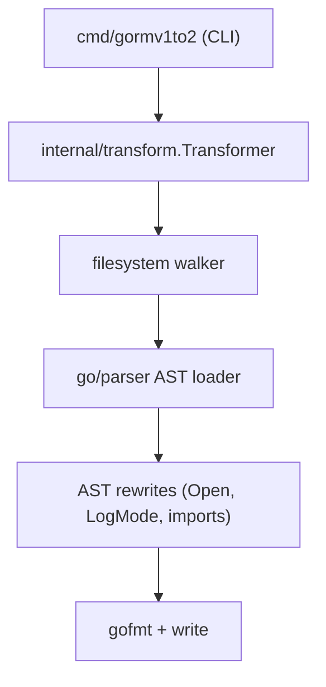
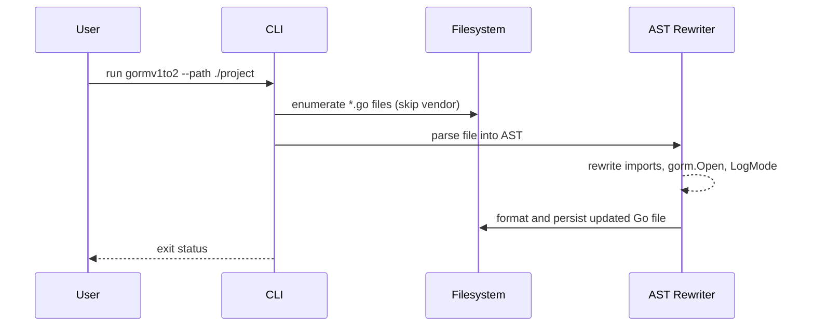
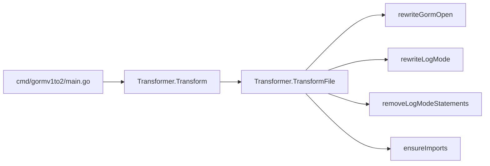

# gorm-v1to-v2

A tool that automatically migrates legacy GORM v1 code (`github.com/jinzhu/gorm`) to modern GORM v2 (`gorm.io/gorm`).

## Quick start

```bash
# Run the migrator against your codebase (defaults to current directory)
go run ./cmd/gormv1to2 --path /path/to/your/project
```

## System architecture



## Data flow



## Call graph (core path)



## User-visible use cases

- As a maintainer, I can point the CLI at a repository to rewrite GORM v1 usage to GORM v2 idioms without changing business logic.
- As a developer, I get automatic driver import insertion when `gorm.Open` uses MySQL, Postgres, SQLite, or SQL Server dialects.
- As an engineer, I can remove `LogMode` usage automatically and rely on GORM v2 logging defaults.

## Migration rules implemented

- Replace `github.com/jinzhu/gorm` imports with `gorm.io/gorm` and add the correct driver import inferred from `gorm.Open` dialect strings.
- Convert `gorm.Open("dialect", dsn)` to `gorm.Open(dialectDriver.Open(dsn), &gorm.Config{})`.
- Drop legacy `LogMode` calls while keeping surrounding logic intact.
- Preserve other business logic and only update GORM-specific code paths.
